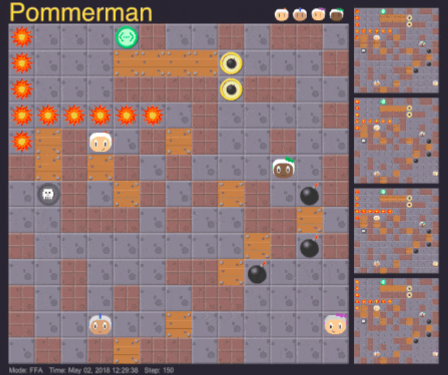

# Pommerman_Project
This project features a deep reinforcement learning model training an Actor-Critic agent for the [Pommerman game](https://www.pommerman.com/) AI competition.
The game itself is given to us via the competition.

## How it looks like
Check out our [youtube video](https://www.youtube.com/watch?v=vXTqpb3s9uY&ab_channel=JacobPjetursson) for how the model performs in action.
### Picture of the game

## Running the code
Go to [https://github.com/MultiAgentLearning/playground/tree/master/docs] and follow the guide there on installing the Pommerman game. You can use the game folder from this repository for installing.

There is a jupyter notebook file in the src folder for running the code. 
From here it is possible to both train a new model and visualize a pretrained one.
It takes around 20 hours of training on a decent GPU to see real progress.

